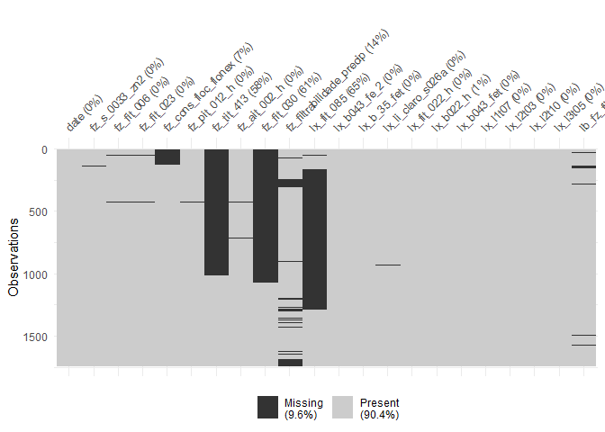
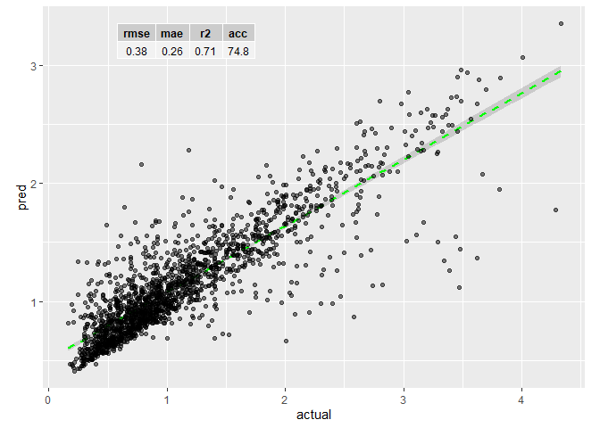

# nexaverser

<!-- badges: start -->
<!-- badges: end -->

The goal of nexaverser is to facilitate data science initiatives at Nexa
Resources by automating the most common tasks that are commonly
performed in a data science project.

## Installation

You can install the development version of nexaverser from
[GitHub](https://github.com/) with:

``` r
# install.packages("devtools")
devtools::install_github("octaviodeliberato/nexaverser")
```

This is a basic example which shows you how to solve a common problem:

## Data prep

``` r
library(nexaverser)

# Import data from belt filter S033
tag_tbl <- nexaverser::fz_data

# Define target output
y <- "lb_fz_filtros033silw_zn"

# Let's see the distribution of NAs across our data
visdat::vis_miss(tag_tbl)
```



``` r

# Let's keep only columns with at least 2/3 of valid data ...
keep <- colMeans(!is.na(tag_tbl)) > 2/3
table(keep)
#> keep
#> FALSE  TRUE 
#>     3    19

tag_imp <- tag_tbl[, keep] |>
  # ... impute missing values and ...
  nexaverser::impute_missing_values() |>
  # ... get rid of outliers
  purrr::map_df(\(x) {
    if (class(x) != "Date") {
      timetk::ts_clean_vec(x)
    } else { x }
  })
#> 
#>  iter imp variable
#>   1   1  fz_s_0033_zn2  fz_fit_006  fz_fit_023  fz_cons_floc_flonex  fz_pit_012_h  fz_ait_002_h  fz_filtrabilidade_precip  lx_b043_fe_2  lx_b_35_fet  lx_li_claro_s026a  lx_b022_h  lx_b043_fet  lb_fz_filtros033silw_zn
#>   1   2  fz_s_0033_zn2  fz_fit_006  fz_fit_023  fz_cons_floc_flonex  fz_pit_012_h  fz_ait_002_h  fz_filtrabilidade_precip  lx_b043_fe_2  lx_b_35_fet  lx_li_claro_s026a  lx_b022_h  lx_b043_fet  lb_fz_filtros033silw_zn
#>   1   3  fz_s_0033_zn2  fz_fit_006  fz_fit_023  fz_cons_floc_flonex  fz_pit_012_h  fz_ait_002_h  fz_filtrabilidade_precip  lx_b043_fe_2  lx_b_35_fet  lx_li_claro_s026a  lx_b022_h  lx_b043_fet  lb_fz_filtros033silw_zn
#>   1   4  fz_s_0033_zn2  fz_fit_006  fz_fit_023  fz_cons_floc_flonex  fz_pit_012_h  fz_ait_002_h  fz_filtrabilidade_precip  lx_b043_fe_2  lx_b_35_fet  lx_li_claro_s026a  lx_b022_h  lx_b043_fet  lb_fz_filtros033silw_zn
#>   1   5  fz_s_0033_zn2  fz_fit_006  fz_fit_023  fz_cons_floc_flonex  fz_pit_012_h  fz_ait_002_h  fz_filtrabilidade_precip  lx_b043_fe_2  lx_b_35_fet  lx_li_claro_s026a  lx_b022_h  lx_b043_fet  lb_fz_filtros033silw_zn
#>   2   1  fz_s_0033_zn2  fz_fit_006  fz_fit_023  fz_cons_floc_flonex  fz_pit_012_h  fz_ait_002_h  fz_filtrabilidade_precip  lx_b043_fe_2  lx_b_35_fet  lx_li_claro_s026a  lx_b022_h  lx_b043_fet  lb_fz_filtros033silw_zn
#>   2   2  fz_s_0033_zn2  fz_fit_006  fz_fit_023  fz_cons_floc_flonex  fz_pit_012_h  fz_ait_002_h  fz_filtrabilidade_precip  lx_b043_fe_2  lx_b_35_fet  lx_li_claro_s026a  lx_b022_h  lx_b043_fet  lb_fz_filtros033silw_zn
#>   2   3  fz_s_0033_zn2  fz_fit_006  fz_fit_023  fz_cons_floc_flonex  fz_pit_012_h  fz_ait_002_h  fz_filtrabilidade_precip  lx_b043_fe_2  lx_b_35_fet  lx_li_claro_s026a  lx_b022_h  lx_b043_fet  lb_fz_filtros033silw_zn
#>   2   4  fz_s_0033_zn2  fz_fit_006  fz_fit_023  fz_cons_floc_flonex  fz_pit_012_h  fz_ait_002_h  fz_filtrabilidade_precip  lx_b043_fe_2  lx_b_35_fet  lx_li_claro_s026a  lx_b022_h  lx_b043_fet  lb_fz_filtros033silw_zn
#>   2   5  fz_s_0033_zn2  fz_fit_006  fz_fit_023  fz_cons_floc_flonex  fz_pit_012_h  fz_ait_002_h  fz_filtrabilidade_precip  lx_b043_fe_2  lx_b_35_fet  lx_li_claro_s026a  lx_b022_h  lx_b043_fet  lb_fz_filtros033silw_zn
#>   3   1  fz_s_0033_zn2  fz_fit_006  fz_fit_023  fz_cons_floc_flonex  fz_pit_012_h  fz_ait_002_h  fz_filtrabilidade_precip  lx_b043_fe_2  lx_b_35_fet  lx_li_claro_s026a  lx_b022_h  lx_b043_fet  lb_fz_filtros033silw_zn
#>   3   2  fz_s_0033_zn2  fz_fit_006  fz_fit_023  fz_cons_floc_flonex  fz_pit_012_h  fz_ait_002_h  fz_filtrabilidade_precip  lx_b043_fe_2  lx_b_35_fet  lx_li_claro_s026a  lx_b022_h  lx_b043_fet  lb_fz_filtros033silw_zn
#>   3   3  fz_s_0033_zn2  fz_fit_006  fz_fit_023  fz_cons_floc_flonex  fz_pit_012_h  fz_ait_002_h  fz_filtrabilidade_precip  lx_b043_fe_2  lx_b_35_fet  lx_li_claro_s026a  lx_b022_h  lx_b043_fet  lb_fz_filtros033silw_zn
#>   3   4  fz_s_0033_zn2  fz_fit_006  fz_fit_023  fz_cons_floc_flonex  fz_pit_012_h  fz_ait_002_h  fz_filtrabilidade_precip  lx_b043_fe_2  lx_b_35_fet  lx_li_claro_s026a  lx_b022_h  lx_b043_fet  lb_fz_filtros033silw_zn
#>   3   5  fz_s_0033_zn2  fz_fit_006  fz_fit_023  fz_cons_floc_flonex  fz_pit_012_h  fz_ait_002_h  fz_filtrabilidade_precip  lx_b043_fe_2  lx_b_35_fet  lx_li_claro_s026a  lx_b022_h  lx_b043_fet  lb_fz_filtros033silw_zn
#>   4   1  fz_s_0033_zn2  fz_fit_006  fz_fit_023  fz_cons_floc_flonex  fz_pit_012_h  fz_ait_002_h  fz_filtrabilidade_precip  lx_b043_fe_2  lx_b_35_fet  lx_li_claro_s026a  lx_b022_h  lx_b043_fet  lb_fz_filtros033silw_zn
#>   4   2  fz_s_0033_zn2  fz_fit_006  fz_fit_023  fz_cons_floc_flonex  fz_pit_012_h  fz_ait_002_h  fz_filtrabilidade_precip  lx_b043_fe_2  lx_b_35_fet  lx_li_claro_s026a  lx_b022_h  lx_b043_fet  lb_fz_filtros033silw_zn
#>   4   3  fz_s_0033_zn2  fz_fit_006  fz_fit_023  fz_cons_floc_flonex  fz_pit_012_h  fz_ait_002_h  fz_filtrabilidade_precip  lx_b043_fe_2  lx_b_35_fet  lx_li_claro_s026a  lx_b022_h  lx_b043_fet  lb_fz_filtros033silw_zn
#>   4   4  fz_s_0033_zn2  fz_fit_006  fz_fit_023  fz_cons_floc_flonex  fz_pit_012_h  fz_ait_002_h  fz_filtrabilidade_precip  lx_b043_fe_2  lx_b_35_fet  lx_li_claro_s026a  lx_b022_h  lx_b043_fet  lb_fz_filtros033silw_zn
#>   4   5  fz_s_0033_zn2  fz_fit_006  fz_fit_023  fz_cons_floc_flonex  fz_pit_012_h  fz_ait_002_h  fz_filtrabilidade_precip  lx_b043_fe_2  lx_b_35_fet  lx_li_claro_s026a  lx_b022_h  lx_b043_fet  lb_fz_filtros033silw_zn
#>   5   1  fz_s_0033_zn2  fz_fit_006  fz_fit_023  fz_cons_floc_flonex  fz_pit_012_h  fz_ait_002_h  fz_filtrabilidade_precip  lx_b043_fe_2  lx_b_35_fet  lx_li_claro_s026a  lx_b022_h  lx_b043_fet  lb_fz_filtros033silw_zn
#>   5   2  fz_s_0033_zn2  fz_fit_006  fz_fit_023  fz_cons_floc_flonex  fz_pit_012_h  fz_ait_002_h  fz_filtrabilidade_precip  lx_b043_fe_2  lx_b_35_fet  lx_li_claro_s026a  lx_b022_h  lx_b043_fet  lb_fz_filtros033silw_zn
#>   5   3  fz_s_0033_zn2  fz_fit_006  fz_fit_023  fz_cons_floc_flonex  fz_pit_012_h  fz_ait_002_h  fz_filtrabilidade_precip  lx_b043_fe_2  lx_b_35_fet  lx_li_claro_s026a  lx_b022_h  lx_b043_fet  lb_fz_filtros033silw_zn
#>   5   4  fz_s_0033_zn2  fz_fit_006  fz_fit_023  fz_cons_floc_flonex  fz_pit_012_h  fz_ait_002_h  fz_filtrabilidade_precip  lx_b043_fe_2  lx_b_35_fet  lx_li_claro_s026a  lx_b022_h  lx_b043_fet  lb_fz_filtros033silw_zn
#>   5   5  fz_s_0033_zn2  fz_fit_006  fz_fit_023  fz_cons_floc_flonex  fz_pit_012_h  fz_ait_002_h  fz_filtrabilidade_precip  lx_b043_fe_2  lx_b_35_fet  lx_li_claro_s026a  lx_b022_h  lx_b043_fet  lb_fz_filtros033silw_zn
#> Warning: Number of logged events: 337
#> Registered S3 method overwritten by 'quantmod':
#>   method            from
#>   as.zoo.data.frame zoo

# Last but not least, let's have a look at our data
tag_imp |> dplyr::glimpse()
#> Rows: 1,738
#> Columns: 19
#> $ date                     <date> 2018-01-01, 2018-01-02, 2018-01-03, 2018-01-…
#> $ fz_s_0033_zn2            <dbl> 62.55222, 62.17818, 56.44514, 62.10764, 59.45…
#> $ fz_fit_006               <dbl> 78.87933, 72.37445, 70.13202, 77.73212, 76.17…
#> $ fz_fit_023               <dbl> 34.60250, 38.11808, 31.09629, 31.89798, 35.63…
#> $ fz_cons_floc_flonex      <dbl> 51.87500, 46.87500, 31.04167, 45.20833, 38.12…
#> $ fz_pit_012_h             <dbl> -10.273022, -9.604367, -10.088747, -11.402455…
#> $ fz_ait_002_h             <dbl> 3.685524, 3.685524, 3.685524, 3.685524, 3.685…
#> $ fz_filtrabilidade_precip <dbl> 53.00000, 55.66667, 58.75000, 81.00000, 57.26…
#> $ lx_b043_fe_2             <dbl> 1117.9833, 720.6250, 534.6500, 912.0750, 315.…
#> $ lx_b_35_fet              <dbl> 28.33333, 33.21250, 37.00833, 39.13750, 36.22…
#> $ lx_li_claro_s026a        <dbl> 1.7996212, 1.8261364, 1.8854545, 1.9763889, 1…
#> $ lx_fit_022_h             <dbl> 96.14904, 104.61852, 97.98859, 100.99727, 121…
#> $ lx_b022_h                <dbl> 5.702381, 6.447262, 7.428493, 7.027024, 7.108…
#> $ lx_b043_fet              <dbl> 2037.440, 3223.917, 5385.000, 3479.556, 2425.…
#> $ lx_l1t07                 <dbl> 91.66056, 91.31868, 89.20940, 91.58120, 92.97…
#> $ lx_l2t03                 <dbl> 31.43904, 32.43449, 32.90842, 30.25359, 28.47…
#> $ lx_l2t10                 <dbl> 97.57709, 96.33981, 96.94368, 96.71850, 96.49…
#> $ lx_l3t05                 <dbl> 81.06532, 80.85658, 79.24298, 80.91575, 79.47…
#> $ lb_fz_filtros033silw_zn  <dbl> 0.420, 0.580, 0.820, 0.920, 0.850, 0.350, 0.9…
```

# Feature selection

``` r
# Now that we are happy with our prepared data, let's use `Boruta` to find the most important predictors to our model
sel_features_1 <- nexaverser::select_features_with_boruta(
  .tag_dat        = tag_imp,
  .target         = y,
  .balance        = FALSE,
  .with_tentative = FALSE,
  .return_data    = FALSE,
  .task           = "regression"
)

# 'Final' dataset
df <- tag_imp |>
  dplyr::select(dplyr::all_of(c(sel_features_1, y)))
```

The selected variables are: fz_s\_0033_zn2, fz_fit_006, fz_fit_023,
fz_cons_floc_flonex, fz_pit_012_h, fz_ait_002_h,
fz_filtrabilidade_precip, lx_b043_fe_2, lx_b\_35_fet, lx_li_claro_s026a,
lx_fit_022_h, lx_b022_h, lx_b043_fet, lx_l1t07, lx_l2t03, lx_l2t10,
lx_l3t05. The target variable is: lb_fz_filtros033silw_zn

## Modeling

There are many modeling techniques to choose from `{nexaverser}`. for
this particular example, we will use the mighty random forest.

``` r
rf_model <- nexaverser::train_ranger_model(
  .data            = df,
  .target          = y,
  .strat           = FALSE,
  .tune            = FALSE,
  .surrogate_model = TRUE
)

rf_model[["test_plot"]]
#> `geom_smooth()` using formula = 'y ~ x'
```



Finally, the variable importance of this model can be accessed with:

``` r{vip}
rf_model$model$fit$fit$fit |> vip::vip()
```
